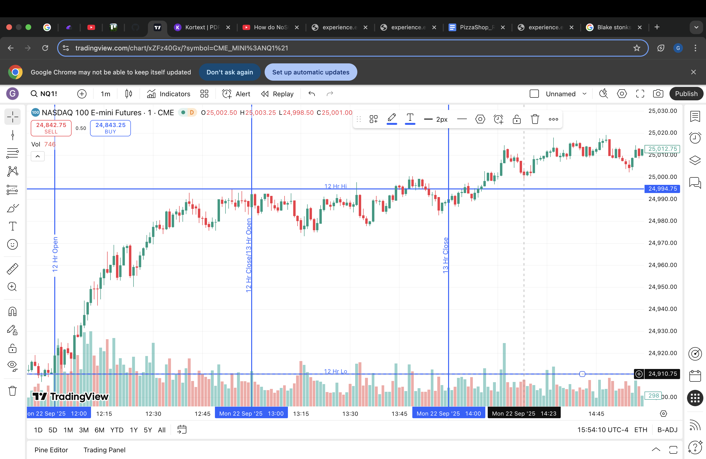

# HOURSTAT PATTERN FINDER
The script should iterate through a CSV of NQ prices of any date, find places in which a previous hour's low
is swept within the first 20 minutes, and determine if the price returns.

## Sample of successful hour stat

This is an example of a succesful instance of the Hour Stat. After the previous hour's high is swept around the 30-minute mark, with the
price dropping and quickly returning to the hour's open.

## Goal - Find how often the strategy works
Determine a hitrate for the NQ prices from 2014 to 2024. First, determine if a two-hour window contains a sweep, then determine
if the price returns. Only sweeps are considered valid setups.

# Results - Overall Accuracy - 60%
Roughly, the hour stat held true for 60% of valid setups. Data sample:

## Hourly Hit-rates:

Total setups found: 20095
Win rate: 60.56%
- Hour 8: Up Setups: 808, Win Rate: 83.29%
- Hour 8: Down Setups: 784, Win Rate: 86.48%
- Hour 9: Up Setups: 1000, Win Rate: 59.80%
- Hour 9: Down Setups: 1136, Win Rate: 60.30%
- Hour 10: Up Setups: 744, Win Rate: 61.16%
- Hour 10: Down Setups: 956, Win Rate: 57.43%
- Hour 11: Up Setups: 756, Win Rate: 62.04%
- Hour 11: Down Setups: 916, Win Rate: 61.14%
- Hour 12: Up Setups: 793, Win Rate: 64.06%
- Hour 12: Down Setups: 971, Win Rate: 62.82%
- Hour 13: Up Setups: 893, Win Rate: 63.27%
- Hour 13: Down Setups: 1002, Win Rate: 62.48%
- Hour 14: Up Setups: 836, Win Rate: 69.50%
- Hour 14: Down Setups: 981, Win Rate: 69.72%
- Hour 15: Up Setups: 545, Win Rate: 48.26%
- Hour 15: Down Setups: 697, Win Rate: 40.17%

# IMPORTANT - INPUT CSV IS NOT INCLUDED IN THIS REPOSITORY!

Add the input csv as 'nq-1m_bk.csv'. Input file must be in one-minute intervals

# Running:
- Ensure nq-1m_bk.csv is in the same directory as hour_stat.py
- Results csv will be in results directory
