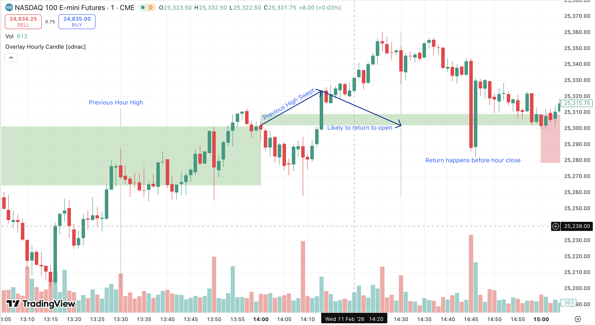
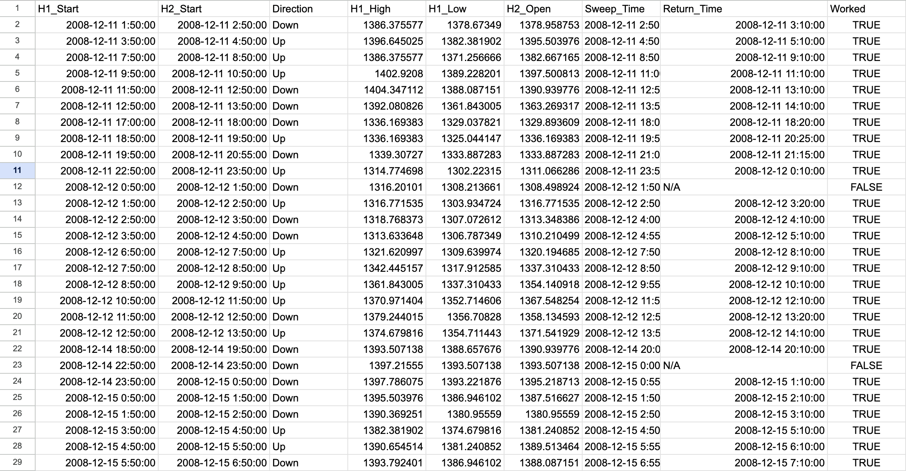
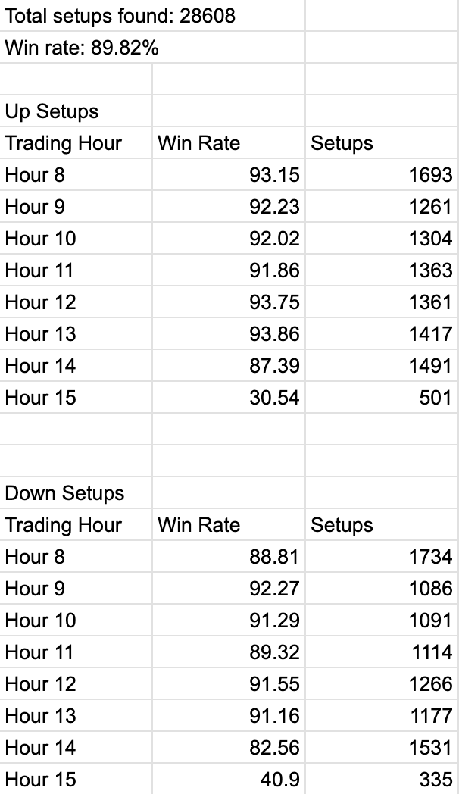

# HOURSTAT PATTERN FINDER
The script should iterate through a CSV of NQ prices of any date, find places in which a previous hour's low
is swept within the first 20 minutes, and determine if the price returns.

## Sample of successful hour stat

This is an example of a succesful instance of the Hour Stat. After the previous hour's high is swept around the 30-minute mark, with the
price dropping and quickly returning to the hour's open.

## Goal - Find how often the strategy works
Determine a hitrate for the NQ prices from 2014 to 2024. First, determine if a two-hour window contains a sweep, then determine
if the price returns. Only sweeps are considered valid setups.

# Results - Overall Accuracy - 89%
Roughly, the hour stat held true for 60% of valid setups. Data sample:

## Hourly Hit-rates:

# IMPORTANT - INPUT CSV IS NOT INCLUDED IN THIS REPOSITORY!

Add the input csv as 'nq-1m_bk.csv'. Input file must be in one-minute intervals

# Running:
- Ensure nq-1m_bk.csv is in the same directory as hour_stat.py
- Results csv will be in results directory
